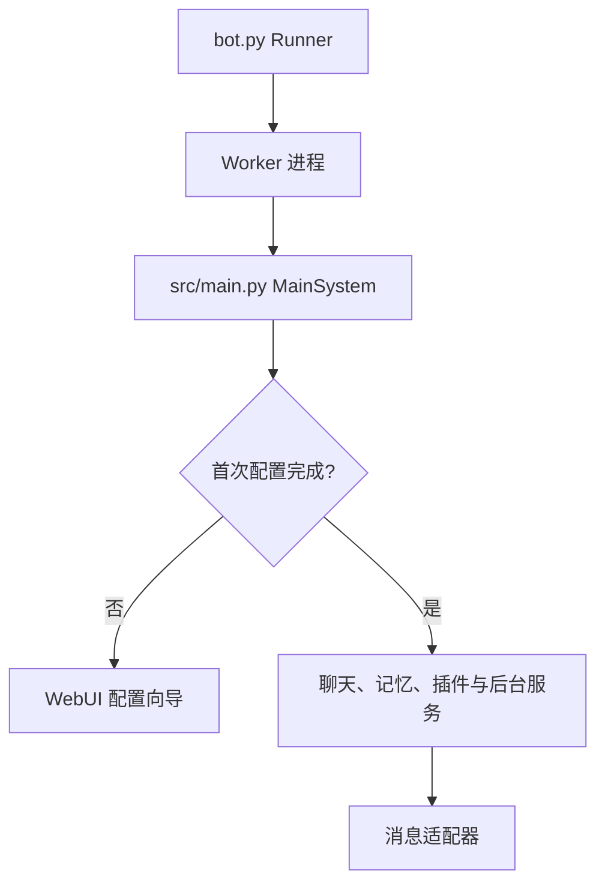

# 架构概览

本文帮助你建立对 RiyaBot 代码结构的整体认识，便于定位功能、排查问题或开发插件。所有描述均以当前源码为准。

## 进程模型：Runner / Worker

入口是 `bot.py`，采用双进程模型：

- **Runner**：直接运行 `python bot.py` 时进入的守护进程，负责启动并监控 Worker；
- **Worker**：真正跑主系统的子进程，通过环境变量 `MAIBOT_WORKER_PROCESS=1` 标识。

Worker 以退出码 `42`（`RESTART_EXIT_CODE`）退出时，Runner 会重启它；另有专门的退出码用于触发一键更新后重新载入。这样配置热重载、程序更新都能在不手动介入的情况下完成。

主系统的初始化与调度集中在 `src/main.py` 的 `MainSystem`：首次配置未完成时只启动 WebUI 向导，配置就绪后再初始化聊天、记忆、插件等组件。



## 后端目录结构

```text
src/
├── chat/           # 聊天运行时：消息接收、规划、回复生成、表情
├── memory/         # 长期记忆与检索（SQLite + 可选 Qdrant 向量索引）
├── bw_learner/     # 行为与表达学习
├── plugin_system/  # 插件 SDK 与运行时
├── config/         # 类型化配置定义、生成与升级
├── llm_models/     # 模型调用与 embedding
├── webui/          # FastAPI WebUI 后端
├── common/         # 日志、数据库、Prompt、基础设施
├── manager/        # 异步任务管理等
├── services/       # 后台服务任务
└── update_system/  # 程序自更新
```

## 聊天运行时（src/chat）

聊天是 RiyaBot 的核心。消息进入后由 `heart_flow/heartflow.py` 按聊天类型分派：

- **群聊**走 `HeartFChatting`（`heart_flow/`），包含轮次调度（`ReplyTurnScheduler`）与发言频率控制；
- **私聊**走 `BrainChatting`（`brain_chat/`）及其 `PrivateToolPipeline`。

两条路径都通过**原生 LLM 工具调用**工作，共享 `chat_tool_registry.py` 里的 `ChatToolRegistry`：

- **Planner**（`planner_actions/`）负责选择要调用的工具；
- 内置的 `reply` 工具被选中后，由 `replyer/` 的群聊/私聊生成器写出回复文本；
- 模型不发起任何工具调用即表示本轮静默结束。

插件的 `BaseAction` 通过 `ActionManager` 在兼容边界接入，会被转换成原生工具 schema 提供给模型。聊天历史、记忆证据、插件描述与工具结果都被当作**不可信的模型输入**处理。

## 记忆系统（src/memory）

记忆是一个持久化的系统边界，所有读写都通过统一接口进行：

- **SQLite 是唯一事实来源**（`schema.py`、`store.py`），**Qdrant 向量索引是可选的**，向量层不可用时会优雅降级；
- 统一通过 `MemoryStore` / `QdrantManager` 访问，写操作有排序、恢复与一致性协调机制（`write_ops.py`、`reconciliation.py`）；
- 编码管线（`encoding_pipeline.py`、`layer*_*.py`）与检索、遗忘（`forgetting.py`）、梦境编织（`dream_weaver.py`）等作为后台任务周期运行。

嵌入维度、embedding 模型签名需与配置中的 `[memory]` 保持一致，详见[配置指南](configuration.md)。

## 行为与表达学习（src/bw_learner）

该模块从聊天记录中学习**行为**、**表达方式**和**黑话（jargon）**，产出「学到的状态」供回复时使用；持久化的记忆仍归 `src/memory/`。学习范围按聊天流配置，见配置中的 `[expression]` 与 `[behavior]` 段。

## 插件系统（src/plugin_system）

插件系统负责发现插件、校验 manifest 与依赖、注册组件、分发事件，并向插件暴露稳定 API。

- 插件代码应从 `src.plugin_system` 或 `src.plugin_system.apis` 导入，不要直接触碰 `core/`；
- 每个插件目录需要 `_manifest.json` 和一个用 `@register_plugin` 装饰的 `BasePlugin` 子类；
- 支持的组件：`BaseAction`、`BaseCommand`、`BaseTool`、`BaseEventHandler`；
- `apis/` 提供 chat、send、message、模型、数据库、person、emoji、配置、tool、插件等门面。

详见[插件开发文档](../plugins/index.md)。

## WebUI 后端（src/webui）

基于 FastAPI，默认监听 `127.0.0.1:8001`（`WEBUI_HOST` / `WEBUI_PORT` 可调），同时托管 `webui/dist/` 里构建好的前端。`webui_server.py` 统一配置异常处理、请求限制、同源保护、防爬、安全头与 SPA 回退；`routes.py` 汇聚配置、统计、人物、表达、行为、表情、记忆、插件、模型、设置、系统等路由，另有 `/api/chat`、`/api/planner`、`/ws/logs` 等独立路由。

认证使用 HttpOnly 的 `maibot_session` 会话 Cookie，WebSocket 使用一次性短时令牌。所有状态变更请求都要经过同源保护，服务端错误会被脱敏，不会返回异常文本、路径或令牌。

## 配置系统（src/config）

配置 schema 用 Python dataclass（`ConfigBase`）定义，运行时的 TOML 由程序自动生成和升级：

- `official_configs.py` — `bot_config.toml` 的规范定义；
- `api_ada_configs.py` — `model_config.toml`（模型供应商、模型、任务分配）；
- `config_generation.py` — 生成、升级与原子化持久化。

根目录的 `config/` 是**生成出来的运行时状态**，不是事实来源。字段说明见[配置指南](configuration.md)。
