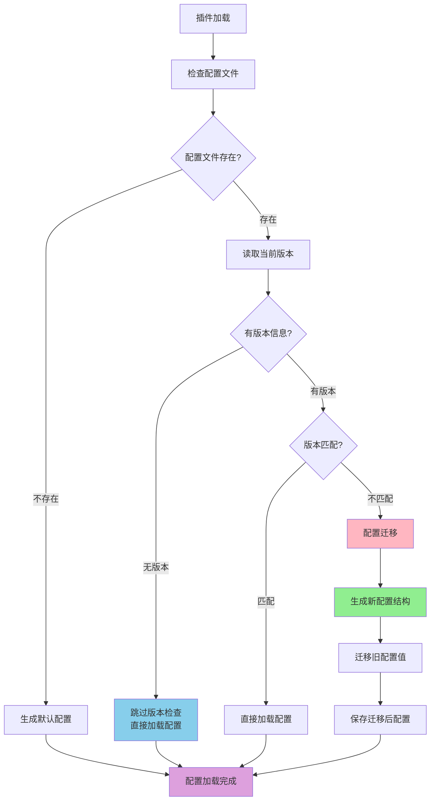

# ⚙️ 插件配置指南

本文说明如何为插件**定义配置**、并在组件中**读取配置**。

> **🚨 不要手动创建 `config.toml` 文件。** 系统会根据代码中的 `config_schema` 自动生成配置文件。手动创建会破坏自动化流程，导致配置不一致、缺少注释和文档。

## 配置版本管理

插件升级时配置结构可能变化。系统通过 `config_version` 检测版本差异，并在必要时自动迁移配置，保证配置结构与代码保持同步：



### 定义版本

在 `config_schema` 的 `plugin` 节中定义 `config_version`：

```python
config_schema = {
    "plugin": {
        "enabled": ConfigField(type=bool, default=False, description="是否启用插件"),
        "config_version": ConfigField(type=str, default="1.2.0", description="配置文件版本"),
    },
    # 其他配置...
}
```

### 版本检查行为

- **无版本信息**：跳过版本检查和迁移，直接加载现有配置，用于兼容没有版本号的旧插件（日志显示 `配置文件无版本信息，跳过版本检查`）。新增的配置项不会写入该文件，代码通过 `get_config()` 的默认值读取它们。
- **版本匹配**：直接加载现有配置。
- **版本不匹配**：自动执行配置迁移，过程如下：

1. 根据最新的 `config_schema` 生成新配置结构；
2. 保留旧配置中仍然存在的字段值；
3. 新增的配置项写入 Schema 中定义的默认值；
4. 将 `config_version` 更新为最新版本；
5. 覆盖写回原配置文件。

被移除的配置项会在日志中输出警告。

> **⚠️ 迁移会直接覆盖原文件，不保留备份、不自动回滚。** 修改 `config_schema` 前，请先备份配置并在测试环境验证。

### 升级示例

假设插件从 v1.0 升级到 v1.1，新增了权限管理功能。旧版本配置：

```toml
[plugin]
enabled = true
config_version = "1.0.0"

[mute]
min_duration = 60
max_duration = 3600
```

新版本 Schema（新增 `permissions` 节）：

```python
config_schema = {
    "plugin": {
        "enabled": ConfigField(type=bool, default=False, description="是否启用插件"),
        "config_version": ConfigField(type=str, default="1.1.0", description="配置文件版本"),
    },
    "mute": {
        "min_duration": ConfigField(type=int, default=60, description="最短禁言时长（秒）"),
        "max_duration": ConfigField(type=int, default=2592000, description="最长禁言时长（秒）"),
    },
    "permissions": {  # 新增的配置节
        "allowed_users": ConfigField(type=list, default=[], description="允许的用户列表"),
        "allowed_groups": ConfigField(type=list, default=[], description="允许的群组列表"),
    }
}
```

迁移后：`[mute]` 的字段值被保留，新增的 `[permissions]` 节写入默认值，`config_version` 更新为 `1.1.0`。

## 配置定义

配置定义在插件主类（继承自 `BasePlugin`）中完成，主要有两个类属性：

1. `config_section_descriptions`：字典，描述配置文件的各个区段（`[section]`）；
2. `config_schema`：核心部分，嵌套字典，定义每个区段下的具体配置项。

### `ConfigField`：配置项的定义

每个配置项通过一个 `ConfigField` 对象定义。`ConfigField` 是一个 dataclass（定义见 `src/plugin_system/base/config_types.py`），常用字段如下：

```python
from src.plugin_system import ConfigField

@dataclass
class ConfigField:
    """配置字段定义（此处仅列出常用字段）"""
    type: type                              # 字段类型 (例如 str, int, float, bool, list, dict)
    default: Any                            # 默认值
    description: str                        # 字段描述（将作为注释生成到配置文件中，也用作默认标签）
    example: Optional[str] = None           # 示例值（用于生成配置文件注释）
    required: bool = False                  # 是否必需
    choices: Optional[List[Any]] = None     # 可选值列表（用于下拉选择）
```

> `ConfigField` 还支持 `min`/`max`/`step`、`placeholder`、`hint`、`input_type`、`order` 等用于 WebUI 渲染和校验的字段，完整定义请查阅源码。

### 配置示例

以禁言插件 `MutePlugin` 为例（这里仅作演示，插件本身不一定存在于仓库中）：

```python
from src.plugin_system import BasePlugin, register_plugin, ConfigField
from typing import List, Tuple, Type

@register_plugin
class MutePlugin(BasePlugin):
    """禁言插件"""

    # 这里是插件基本信息，略去

    # 步骤1: 定义配置节的描述
    config_section_descriptions = {
        "plugin": "插件启用配置",
        "components": "组件启用控制",
        "mute": "核心禁言功能配置",
        "smart_mute": "智能禁言Action的专属配置",
    }

    # 步骤2: 使用ConfigField定义详细的配置Schema
    config_schema = {
        "plugin": {
            "enabled": ConfigField(type=bool, default=False, description="是否启用插件")
        },
        "components": {
            "enable_smart_mute": ConfigField(type=bool, default=True, description="是否启用智能禁言Action"),
            "enable_mute_command": ConfigField(type=bool, default=False, description="是否启用禁言命令Command")
        },
        "mute": {
            "min_duration": ConfigField(type=int, default=60, description="最短禁言时长（秒）"),
            "max_duration": ConfigField(type=int, default=2592000, description="最长禁言时长（秒），默认30天"),
            "templates": ConfigField(
                type=list,
                default=["好的，禁言 {target} {duration}，理由：{reason}", "收到，对 {target} 执行禁言 {duration}"],
                description="成功禁言后发送的随机消息模板"
            )
        },
        "smart_mute": {
            "keyword_sensitivity": ConfigField(
                type=str,
                default="normal",
                description="关键词激活的敏感度",
                choices=["low", "normal", "high"] # 定义可选值
            ),
        },
        "logging": {
            "level": ConfigField(
                type=str,
                default="INFO",
                description="日志记录级别",
                choices=["DEBUG", "INFO", "WARNING", "ERROR"]
            ),
            "prefix": ConfigField(type=str, default="[MutePlugin]", description="日志记录前缀", example="[MyMutePlugin]")
        }
    }

    # 这里是插件方法，略去
```

当插件首次加载且目录中不存在 `config.toml` 时，系统会自动生成以下文件：

```toml
# mute_plugin - 自动生成的配置文件
# 群聊禁言管理插件，提供智能禁言功能

# 插件启用配置
[plugin]

# 是否启用插件
enabled = false


# 组件启用控制
[components]

# 是否启用智能禁言Action
enable_smart_mute = true

# 是否启用禁言命令Command
enable_mute_command = false


# 核心禁言功能配置
[mute]

# 最短禁言时长（秒）
min_duration = 60

# 最长禁言时长（秒），默认30天
max_duration = 2592000

# 成功禁言后发送的随机消息模板
templates = ["好的，禁言 {target} {duration}，理由：{reason}", "收到，对 {target} 执行禁言 {duration}"]


# 智能禁言Action的专属配置
[smart_mute]

# 关键词激活的敏感度
# 可选值: low, normal, high
keyword_sensitivity = "normal"


# 日志记录相关配置
[logging]

# 日志记录级别
# 可选值: DEBUG, INFO, WARNING, ERROR
level = "INFO"

# 日志记录前缀
# 示例: [MyMutePlugin]
prefix = "[MutePlugin]"
```

## 配置访问

在组件中，通过内置的 `get_config()` 方法读取配置。参数为命名空间化的字符串，以上面的 `MutePlugin` 为例：

```python
enable_smart_mute = self.get_config("components.enable_smart_mute", True)
```

如果访问了不存在的配置项，`get_config()` 会返回你传入的默认值；未传默认值时返回 `None`。

## 最佳实践

1. **Schema 优先**：所有配置项都必须在 `config_schema` 中声明，包括类型、默认值和描述。
2. **描述清晰**：为每个 `ConfigField` 和 `config_section_descriptions` 编写清晰、准确的描述，它们会直接成为配置文件的注释。
3. **提供合理默认值**：确保插件在默认配置下就能正常运行（或处于一个安全禁用的状态）。
4. **gitignore**：将 `plugins/*/config.toml` 或 `src/plugins/built_in/*/config.toml` 加入 `.gitignore`，避免提交个人敏感信息。
5. **只修改，不创建**：自动生成的 `config.toml` 只应被用户**修改**，而不是从零创建。

## 相关文档

- [插件快速开始](./quick-start.md) — 从最小插件开始，了解组件注册与配置示例。
- [Manifest 系统指南](./manifest-guide.md) — 了解与运行时配置分离的插件元数据。
