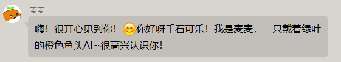

# 🚀 快速开始指南

本指南将带你从零开始创建一个功能完整的 RiyaBot 插件。示例代码位于项目根目录的 `plugins/hello_world_plugin/` 下。

## 准备工作

确保你已经：

1. 克隆了 RiyaBot 项目
2. 安装了 Python 依赖
3. 了解基本的 Python 语法

## 创建插件

### 1. 创建插件目录

在项目根目录的 `plugins/` 文件夹下创建你的插件目录，这里我们命名为 `hello_world_plugin`。

### 2. 创建 `_manifest.json` 文件

在插件目录下面创建一个 `_manifest.json` 文件，内容如下：

```json
{
  "manifest_version": 1,
  "name": "Hello World 插件",
  "version": "1.0.0",
  "description": "一个简单的 Hello World 插件",
  "author": {
    "name": "你的名字"
  }
}
```

有关 `_manifest.json` 的详细说明，请参考 [Manifest 文件指南](./manifest-guide.md)。

### 3. 创建最简单的插件

让我们从最基础的开始！创建 `plugin.py` 文件：

```python
from typing import List, Optional, Tuple, Type
from src.plugin_system import BasePlugin, register_plugin, ComponentInfo

@register_plugin # 注册插件
class HelloWorldPlugin(BasePlugin):
    """Hello World插件 - 你的第一个RiyaBot插件"""

    # 以下是插件基本信息和方法（必须填写）
    plugin_name = "hello_world_plugin"
    enable_plugin = True  # 启用插件
    dependencies = []  # 插件依赖列表（目前为空）
    python_dependencies = []  # Python依赖列表（目前为空）
    config_file_name = "config.toml"  # 配置文件名
    config_schema = {}  # 配置文件模式（目前为空）

    def get_plugin_components(self) -> List[Tuple[ComponentInfo, Type]]: # 获取插件组件
        """返回插件包含的组件列表（目前是空的）"""
        return []
```

🎉 恭喜！你刚刚创建了一个最简单但完整的 RiyaBot 插件！

**解释一下这些代码：**

- `HelloWorldPlugin` 继承自 `BasePlugin`，插件的基本功能都由基类提供；
- `@register_plugin` 装饰器告诉系统这是一个插件；
- `plugin_name` 等是插件的基本信息，必须填写；
- `get_plugin_components()` 返回插件的功能组件。当前示例没有定义 Tool、Action、Command 或 EventHandler，因此返回空列表。

### 4. 测试基础插件

现在就可以测试这个插件了。启动 RiyaBot（直接通过启动器运行，或执行 `python bot.py`），在日志中应该能看到插件加载信息。虽然插件还没有任何功能，但它已经成功运行了！


### 5. 添加第一个功能：原生 Tool

需要让模型按结构化参数调用时，优先使用 `BaseTool`。Tool 会直接进入当前聊天流程的原生工具目录，模型通过 Tool Call 传入参数，工具再返回结构化结果。工具本身不负责生成最终聊天文本，也不应把模型传入的参数当作可信指令。

下面添加一个简单的问候 Tool。它只返回问候结果，由后续聊天流程决定是否生成最终回复：

```python
from typing import Any, List, Tuple, Type

from src.plugin_system import BasePlugin, BaseTool, ComponentInfo, ToolParamType, register_plugin


class GreetingTool(BaseTool):
    """返回一条问候结果。"""

    name = "hello_greeting_tool"
    description = "根据给定内容生成一条简短、友好的问候结果"
    available_for_llm = True
    parameters = [
        ("greeting_message", ToolParamType.STRING, "要包含在问候中的内容", True, None),
    ]

    async def execute(self, function_args: dict[str, Any]) -> dict[str, Any]:
        greeting_message = str(function_args.get("greeting_message", "")).strip()
        if not greeting_message:
            return {"name": self.name, "content": "没有提供问候内容。"}

        return {"name": self.name, "content": f"问候内容：{greeting_message}"}


@register_plugin
class HelloWorldPlugin(BasePlugin):
    """Hello World 插件。"""

    plugin_name = "hello_world_plugin"
    enable_plugin = True
    dependencies = []
    python_dependencies = []
    config_file_name = "config.toml"
    config_schema = {}

    def get_plugin_components(self) -> List[Tuple[ComponentInfo, Type]]:
        return [(GreetingTool.get_tool_info(), GreetingTool)]
```

注册 Tool 时要调用 `get_tool_info()`，而不是 `get_action_info()`。只有 `available_for_llm = True` 的 Tool 会进入模型可用目录。有关参数定义、返回值和错误处理边界，详见 [Tool 组件详解](./tool-components.md)。

### 6. 测试原生 Tool

重启 RiyaBot，在聊天中提出明确需要该能力的请求，例如：

```
请使用问候工具，生成"欢迎新成员"的问候内容。
```

模型可能会调用 `GreetingTool`。Tool 的返回值会作为当前轮次的不可信工具结果继续交给聊天流程；如果模型随后调用内置 `reply`，Replyer 才会生成发给用户的最终文本。没有 Tool Call 并不代表 Tool 注册失败，是否调用仍由模型根据工具描述和当前上下文决定。

🎉 现在你已经完成了一个原生 Tool 插件。

### 7. 添加兼容 Action

如果你需要维护已有的自主聊天动作，本节沿用 `BaseAction`，演示如何维护带有激活机制的兼容组件。

> 新插件若需要被模型按结构化参数直接调用，请先阅读 [Tool 组件详解](./tool-components.md) 并使用 `BaseTool`。Action 已接入统一的 Tool Call 执行边界，但 `BaseAction` 仍是兼容组件。

Action 适合扩展发送表情、禁言、发送语音或操作外部能力等已有聊天动作。更深入的说明见 [Action 组件详解](./action-components.md)，这里先专注把功能跑起来。

现在给插件添加一个兼容 Action，对用户发送一句问候语。下面的代码是只注册该 Action 的最小片段；如果同时保留前面的 Tool，请在最终的 `get_plugin_components()` 返回列表中同时保留两者。

```python
from typing import List, Tuple, Type
from src.plugin_system import (
    BasePlugin, register_plugin, BaseAction,
    ComponentInfo, ActionActivationType
)

# ===== 兼容 Action 组件 =====

class HelloAction(BaseAction):
    """问候Action - 简单的问候动作"""

    # === 基本信息（必须填写）===
    action_name = "hello_greeting"
    action_description = "向用户发送问候消息"
    activation_type = ActionActivationType.ALWAYS  # 始终激活

    # === 功能描述（必须填写）===
    action_parameters = {"greeting_message": "要发送的问候消息"}
    action_require = ["需要发送友好问候时使用", "当有人向你问好时使用", "当你遇见没有见过的人时使用"]
    associated_types = ["text"]

    async def execute(self) -> Tuple[bool, str]:
        """执行问候动作 - 这是核心功能"""
        # 发送问候消息
        greeting_message = self.action_data.get("greeting_message", "")
        base_message = self.get_config("greeting.message", "嗨！很开心见到你！😊")
        message = base_message + greeting_message
        await self.send_text(message)

        return True, "发送了问候消息"

@register_plugin
class HelloWorldPlugin(BasePlugin):
    """Hello World插件 - 你的第一个RiyaBot插件"""

    # 插件基本信息
    plugin_name = "hello_world_plugin"
    enable_plugin = True
    dependencies = []
    python_dependencies = []
    config_file_name = "config.toml"
    config_schema = {}

    def get_plugin_components(self) -> List[Tuple[ComponentInfo, Type]]:
        """返回插件包含的组件列表"""
        return [
            # 添加我们的问候Action
            (HelloAction.get_action_info(), HelloAction),
        ]
```

**解释一下这些代码：**

- `HelloAction` 是我们定义的问候动作类，继承自 `BaseAction`，并实现了核心功能；
- 在 `HelloWorldPlugin` 中，我们通过 `get_plugin_components()` 方法，调用 `get_action_info()` 这个内置方法将 `HelloAction` 注册为插件的一个组件；
- 这样一来，当插件被加载时，问候动作也会被一并加载，并可以在 RiyaBot 中使用；
- `execute()` 函数是 Action 的核心，定义了当 Action 被 RiyaBot 选择后，具体要做什么；
- `self.send_text()` 是发送文本消息的便捷方法。

`activation_type`、`action_parameters`、`action_require`、`associated_types` 等属性的详细说明请参考 [Action 组件详解](./action-components.md)。需要新增原生模型工具时，请参考 [Tool 组件详解](./tool-components.md)。

### 8. 测试兼容 Action

重启 RiyaBot，然后在聊天中发送任意消息，比如：

```
你好
```

RiyaBot 可能会选择使用你的问候 Action，发送回复：

```
嗨！很开心见到你！😊
```



> **💡 小提示**：RiyaBot 会智能地决定什么时候使用它。如果没有立即看到效果，多试几次不同的消息。

🎉 太棒了！你的插件已经有实际功能了！

### 9. 添加第二个功能：时间查询 Command

Command 和 Action 不同，它直接响应用户命令，是确定性的直接响应，不由 LLM 判断是否调用：

```python
# 在现有代码基础上，添加Command组件
import datetime
from src.plugin_system import BaseCommand
#导入Command基类

class TimeCommand(BaseCommand):
    """时间查询Command - 响应/time命令"""

    command_name = "time"
    command_description = "查询当前时间"

    # === 命令设置（必须填写）===
    command_pattern = r"^/time$"  # 精确匹配 "/time" 命令

    async def execute(self) -> Tuple[bool, Optional[str], int]:
        """执行时间查询"""
        # 获取当前时间
        time_format: str = "%Y-%m-%d %H:%M:%S"
        now = datetime.datetime.now()
        time_str = now.strftime(time_format)

        # 发送时间信息
        message = f"⏰ 当前时间：{time_str}"
        await self.send_text(message)

        return True, f"显示了当前时间: {time_str}", 0

@register_plugin
class HelloWorldPlugin(BasePlugin):
    """Hello World插件 - 你的第一个RiyaBot插件"""

    # 插件基本信息
    plugin_name = "hello_world_plugin"
    enable_plugin = True
    dependencies = []
    python_dependencies = []
    config_file_name = "config.toml"
    config_schema = {}

    def get_plugin_components(self) -> List[Tuple[ComponentInfo, Type]]:
        return [
            # 保留前面的原生 Tool
            (GreetingTool.get_tool_info(), GreetingTool),
            (HelloAction.get_action_info(), HelloAction),
            (TimeCommand.get_command_info(), TimeCommand),
        ]
```

同样地，我们通过 `get_plugin_components()` 方法，调用 `get_command_info()` 将 `TimeCommand` 注册为插件组件。

**Command 组件解释：**

- `command_pattern` 使用正则表达式匹配用户输入；
- `^/time$` 表示精确匹配 `/time`。

有关 Command 组件的更多信息，请参考 [Command 组件详解](./command-components.md)。

### 10. 测试时间查询 Command

重启 RiyaBot，发送命令：

```
/time
```

你应该会收到回复：

```
⏰ 当前时间：2024-01-01 12:00:00
```

🎉 现在你已经了解了原生 Tool、兼容 Action 和 Command 的基本用法。新增功能优先从 Tool 或 Command 的适用边界开始判断；只有需要 Action 的激活机制或既有 Action 行为时，才继续使用 `BaseAction`。

---

## 进阶教程

如果你想让插件更加灵活和强大，可以参考接下来的进阶教程。

### 1. 添加配置文件

想要为插件添加配置文件吗？让我们一起来配置 `config_schema` 属性！

> **🚨 重要：不要手动创建 config.toml 文件！**
>
> 我们需要在插件代码中定义配置 Schema，让系统自动生成配置文件。

首先，在插件类中定义配置 Schema：

```python
from src.plugin_system import ConfigField

@register_plugin
class HelloWorldPlugin(BasePlugin):
    """Hello World插件 - 你的第一个RiyaBot插件"""

    # 插件基本信息
    plugin_name: str = "hello_world_plugin"  # 内部标识符
    enable_plugin: bool = True
    dependencies: List[str] = []  # 插件依赖列表
    python_dependencies: List[str] = []  # Python包依赖列表
    config_file_name: str = "config.toml"  # 配置文件名

    # 配置Schema定义
    config_schema: dict = {
        "plugin": {
            "enabled": ConfigField(type=bool, default=True, description="是否启用插件"),
            "config_version": ConfigField(type=str, default="1.0.0", description="配置文件版本"),
        },
        "greeting": {
            "message": ConfigField(type=str, default="嗨！很开心见到你！😊", description="默认问候消息"),
            "enable_emoji": ConfigField(type=bool, default=True, description="是否启用表情符号"),
        },
        "time": {"format": ConfigField(type=str, default="%Y-%m-%d %H:%M:%S", description="时间显示格式")},
    }

    def get_plugin_components(self) -> List[Tuple[ComponentInfo, Type]]:
        return [
            (GreetingTool.get_tool_info(), GreetingTool),
            (HelloAction.get_action_info(), HelloAction),
            (TimeCommand.get_command_info(), TimeCommand),
        ]
```

这会生成一个如下的 `config.toml` 文件：

```toml
# hello_world_plugin - 自动生成的配置文件
# 我的第一个RiyaBot插件，包含问候功能和时间查询等基础示例

# 插件基本信息
[plugin]

# 是否启用插件
enabled = true

# 配置文件版本
config_version = "1.0.0"


# 问候功能配置
[greeting]

# 默认问候消息
message = "嗨！很开心见到你！😊"

# 是否启用表情符号
enable_emoji = true


# 时间查询配置
[time]

# 时间显示格式
format = "%Y-%m-%d %H:%M:%S"
```

然后修改 Action 和 Command 代码，通过 `get_config()` 方法让它们读取配置（配置的键是命名空间式的）：

```python
class HelloAction(BaseAction):
    """问候Action - 简单的问候动作"""

    # === 基本信息（必须填写）===
    action_name = "hello_greeting"
    action_description = "向用户发送问候消息"
    activation_type = ActionActivationType.ALWAYS  # 始终激活

    # === 功能描述（必须填写）===
    action_parameters = {"greeting_message": "要发送的问候消息"}
    action_require = ["需要发送友好问候时使用", "当有人向你问好时使用", "当你遇见没有见过的人时使用"]
    associated_types = ["text"]

    async def execute(self) -> Tuple[bool, str]:
        """执行问候动作 - 这是核心功能"""
        # 发送问候消息
        greeting_message = self.action_data.get("greeting_message", "")
        base_message = self.get_config("greeting.message", "嗨！很开心见到你！😊")
        message = base_message + greeting_message
        await self.send_text(message)

        return True, "发送了问候消息"

class TimeCommand(BaseCommand):
    """时间查询Command - 响应/time命令"""

    command_name = "time"
    command_description = "查询当前时间"

    # === 命令设置（必须填写）===
    command_pattern = r"^/time$"  # 精确匹配 "/time" 命令

    async def execute(self) -> Tuple[bool, Optional[str], int]:
        """执行时间查询"""
        import datetime

        # 获取当前时间
        time_format: str = self.get_config("time.format", "%Y-%m-%d %H:%M:%S")  # type: ignore
        now = datetime.datetime.now()
        time_str = now.strftime(time_format)

        # 发送时间信息
        message = f"⏰ 当前时间：{time_str}"
        await self.send_text(message)

        return True, f"显示了当前时间: {time_str}", 0
```

**配置系统工作流程：**

1. **定义 Schema**：在插件代码中定义配置结构；
2. **自动生成**：启动插件时，系统会自动生成 `config.toml` 文件；
3. **用户修改**：用户可以修改生成的配置文件；
4. **代码读取**：使用 `self.get_config()` 读取配置值。

**绝对不要手动创建 `config.toml` 文件！**

更详细的配置系统介绍请参考 [配置指南](./configuration-guide.md)。

### 2. 创建说明文档

你可以创建一个 `README.md` 文件，描述插件的功能和使用方法，方便自己和他人理解、复用你的插件。

---

🎉 恭喜你！你已经成功创建了自己的插件了！
